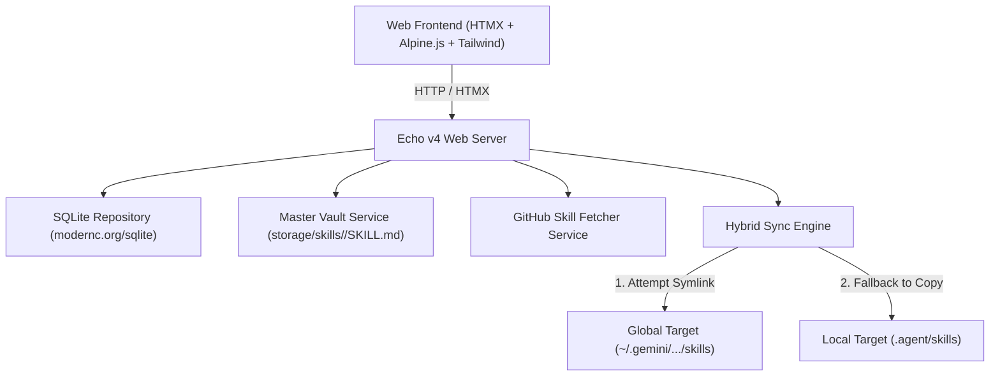

# ⚡ SkillBase

> **All-in-One AI Agent Skill Manager** — Centralize, create, import, and sync skills across multiple AI coding agents (Antigravity CLI, Claude CLI, Cursor, local `.agent/skills`, and custom workspaces).


---

## 🌟 Why SkillBase?

As AI-assisted software development rapidly evolves, developers often manage agent skills (prompts, instructions, and tool definitions) scattered across different locations: global CLI config paths (`~/.gemini/antigravity-cli/skills`), local workspace folders (`.agent/skills`), or third-party GitHub repositories.

**SkillBase** provides a single, beautiful desktop-accessible web interface and backend engine to:
- **Centralize All Skills**: Maintain a single Master Vault of markdown skill files (`storage/skills/<slug>/SKILL.md`).
- **Hybrid Sync Engine**: Instantly deploy skills to any target directory using native OS **Symlinks** (with Windows Junction support) and automatic fallback to recursive directory copying.
- **Auto-Scan & Ingestion**: Existing skill folders (or symlinks) in your target paths are automatically discovered and adopted into your central vault with one click.
- **GitHub Skill Importer**: Directly fetch and parse markdown skill files from GitHub URLs (`blob` or `raw`) into your vault.
- **Lightweight & Dependency-Free Frontend**: Built using Go (Echo v4), pure Go SQLite (`modernc.org/sqlite` — CGO-free), HTMX, Alpine.js, and Tailwind CSS.

---

## ✨ Features

- 📊 **Clean Overview Dashboard**: System metrics, storage status, and quick action cards.
- ⚡ **Skills Library**: Real-time search by name, tag, or content with source filtering (Custom vs. GitHub).
- 🎯 **Agent Targets Manager**: Register multiple global or project-local target directories where skills should be auto-synced.
- 🔍 **Auto-Scan & Adopt**: Scan existing local skill directories and import existing `SKILL.md` files seamlessly.
- 📝 **Markdown Live Editor**: Interactive split-screen editor with real-time markdown preview for creating & editing custom skills.
- 📱 **Fully Responsive Layout**: Mobile slide-over drawer + collapsible desktop sidebar (`w-64` to `w-20`).

---

## 🏗️ Architecture Overview



---

## 🚀 Quickstart

### Prerequisites
- **Go 1.21+** installed on your machine.
- No CGO compiler (gcc) required! (Uses pure Go SQLite).

### Running SkillBase

1. **Clone the repository**:
   ```bash
   git clone https://github.com/your-username/skillbase.git
   cd skillbase
   ```

2. **Run the server**:
   ```bash
   go run main.go
   ```

3. **Open in browser**:
   Navigate to `http://localhost:8080` in your web browser.

---

## 📁 Directory Structure

```
skillbase/
├── main.go                       # Application entrypoint & Echo server setup
├── storage/
│   └── skills/                   # Local Master Vault storage (git-ignored content)
├── internal/
│   ├── database/                 # SQLite connection & schema migrations
│   ├── handlers/                 # Echo web UI HTTP request handlers
│   ├── models/                   # Core data structs (Skill, AgentTarget, Deployment)
│   ├── repository/               # SQL CRUD repositories
│   └── services/                 # Master Vault, Hybrid Sync, & GitHub Importer services
└── web/
    └── templates/
        ├── layouts/              # Master base layout template
        ├── pages/                # Overview, Skills Library, & Targets pages
        └── partials/             # Sidebar, Skill Grid, & Modal dialogs
```

---

## 🧪 Running Tests

SkillBase is built using **Test-Driven Development (TDD)** with 100% pass coverage across core modules:

```bash
go test ./... -v
```

---

## 📄 License

This project is licensed under the **MIT License** — see the [LICENSE](LICENSE) file for details.
